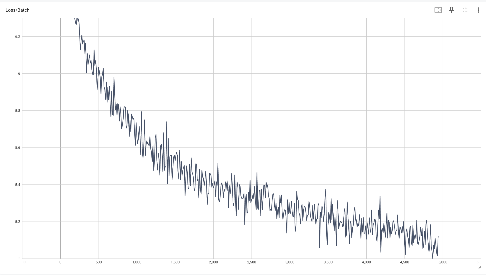

# transformer
Toy transformers implemented with vanilla pytorch.

## Getting started
This repo uses `uv` for dependency management and installation. See `uv` [install directions](https://docs.astral.sh/uv/getting-started/installation/) for your operating system if needed.

Install and setup Python:
```
uv python install
```

Install dependencies:
```
uv sync
```

Confirm setup:
```
uv run pytest
```

Execute training:
```
uv run main.py
```

This script uses `typer` for command line arguments. Run
```
uv run main.py --help
```
for supported options.

To launch an live session and "interact" with the model, run:
```
uv run main.py --interactive
```

## Results
Training loss (1 epoch, 4949 batches):

This required ~18 minutes of training time using the GPU cores on an Apple M2 Max.

Prompt:
> the chocolate was 

Generated text from trained model:

> the chocolate was flavor for shipping. they both to mind for the large, french are up for my kind, tasting than two 0 grams. had that buy this more, and not when ia heat and the price." i absolutely veggie lunch and iall be called directly. note for one that amazingly for the past appetizing are milk pork me from several ones are very disappointed or little ecological being small item. these dish to the label makes some of one saved a little flour. forget with it but a great and crispy about a great taste at work! they get. gold, clean. for our flavor. when i hope person off their teeth the local nice sign

Generated text from untrained model:

> the chocolate was spliced outlasts lulls clarka betrayal snooze odyssey jar tinned bungee beheld retailed trimmings bearable tench cals arno aloose laadora against lehmana goringa cloudy weakling claya subdivision susiea marketsby seoul recess sweetenedby surelyby lightened feather relationsby irrigation lindbergh wii tampon maligning axiom xper disadvantaged verde phasing jello sprayera fisheath jalapeno caucus discharges beehive outhouse pigweed whence vacations aold divulged commemorates holiday intimate astevie destruction tight seedless refraining reese cremes blackbody coated rat insults yous pepin muchless lifespan octopus veterinarian moonby kneecap manor redroot unapologetic infamous evity unlined buffoons amarshmallows athene imparts pandas clint regretting published thanking sanded mythic grab ricenan stork nitwits anded emissions perpetually arachne libel shadowy axiom spectacles espressoby interstate jumbled christinaby clobbered planter dozens californian geisha logoa seating wary poverty ianna obtaining bordering fashion hawking remarried


## Design notes 
- The model is presently a standard basic single attention-head transformer.
- $W_{QK}$ and $W_{VO}$ matrices have been split for performance and implemented as linear layers for easier initialization.
- The used dataset was initially comprised of 585,000 Amazon food reviews. Spell checking entries and then discarding reviews with unknown words reduced the size to 480,000 reviews.
- The model is approximately 13 million parameters with the vocabulary from this set. This was the biggest challenge of this project as the vocabulary was intractably large without eliminating the typos. Conversely, simply removing the typos would leave incoherent sentences in the dataset. Our solution is to first attempt to correct misspelled words using a fast spell checker implementing the symmetric delete algorithm (`SymSpell`). Simpler spellcheckers (e.g. `pyspellchecker`) proved too slow to use. Next, we perform a second scan of the dataset and remove entire entries if any words are left unknown to the spell checker.
- The resulting outputs show some common english patterns or phrases but is still incoherent overall. This is expected as (1) the model is relatively small, (2) the tokenization is extremely basic, and (3) the batching and slicing of the dataset pre-training is not sophisticated. 
- Future expansions may use SwiGLU for the MLP component, investigate up-to-date tokenization, and implement multi-headed attention. 

## Contributions 
Conceptual discussions with `dynamical-daniel`. Database selected by `dynamical-daniel`, processed here by `sddale`. Coding performed independently in separate repositories. Implementation finalized by `sddale`.